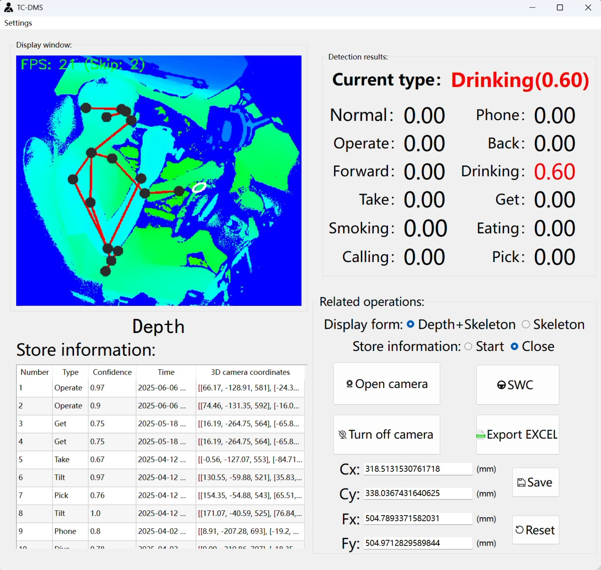

# TC-DM：ToF-based GUI for Driver posture detection and dangerous behavior recognition

## About TC-DM

The Driver Monitoring System (DMS) is an in-vehicle safety technology that continuously monitors driver’s condition in real-time, playing a vital role in reducing traffic accidents. The development of TC-DM provides a streamlined and efficient tool for driver posture detection and behavior recognition using in-vehicle ToF cameras, supporting further research and application in automotive contexts.

TC-DM uses Python as its programming language, and the GUI is developed using [PySide6](https://doc.qt.io/qtforpython-6/) 

## The User Interface

 **TC-DM main system interface.** It's divided into four sections:

- **Top-left:** Shows a color-coded depth map with the driver's skeleton tracking overlaid in real time.
- **Top-right:** Displays detection results for each dangerous driving behavior (whether it's happening or not).
- **Bottom-left:** Lists detected dangerous driving events.
- **Bottom-right:** Houses control buttons like **Start Dangerous Behavior Recording** and **Calibrate Steering Wheel**.




## Pre-built Executable (No Installation Required)

For users who don't want to install Python and dependencies, we provide pre-compiled executable files:

1. **Download Executable**:

   - Visit our Release Page : https://drive.google.com/file/d/17vWgmpwQ318tsDt09p0DPQa6mCNaFZiC/view?usp=sharing
   - Download the latest `DrivingMonitor.7z` file

2. **Unzip and Run**:

   - Extract the downloaded file

   - Open the extracted folder

   - Double-click `dms_start.exe` to launch

     

## Installation Guide 

### Prerequisites

- Python (Recommended Version 3.8)
- pip package manager

### Step-by-Step Installation

1. #### **Clone the repository**:

   ```
   git clone https://github.com/MMMing123/TC-DM
   cd TC-DM
   ```

   *Alternatively, download [ZIP](https://codeload.github.com/MMMing123/TC-DM/zip/refs/heads/main) if Git isn't installed*

2. #### **Install PyTorch:**

   Install PyTorch according to your system configuration. For GPU support (recommended), use the CUDA-enabled version. For CPU-only systems, use the CPU version. Visit the  [official PyTorch website](https://pytorch.org/) for the correct command

3. #### **Install the pyk4a library dependencies**

   To install the `pyk4a` library, please follow the **[official pyk4a installation guide](https://github.com/etiennedub/pyk4a#installation)** from the source repository:

   📁 **Installation Guide:**
   https://github.com/etiennedub/pyk4a#installation

   Simply:

   1. Visit the link above
   2. Follow the step-by-step instructions for your operating system
   3. Verify your installation using the provided test method

4. #### Install Python Dependencies

   ```
   pip install -r requirements.txt
   ```
   
5. #### Download weight file：

   1. Download the file 'yolov5.pt' from [this link](https://drive.google.com/file/d/19NSDf2_pS0S8xEc2o1q7edduVuhJ9DTL/view?usp=drive_link)
2. Place the downloaded `yolov5.pt` file into the `Resources/` folder within the project directory.

### Launching the Application

To start the TC-DM application, run the `dms_start.py` script:

```
python dms_start.py
```

